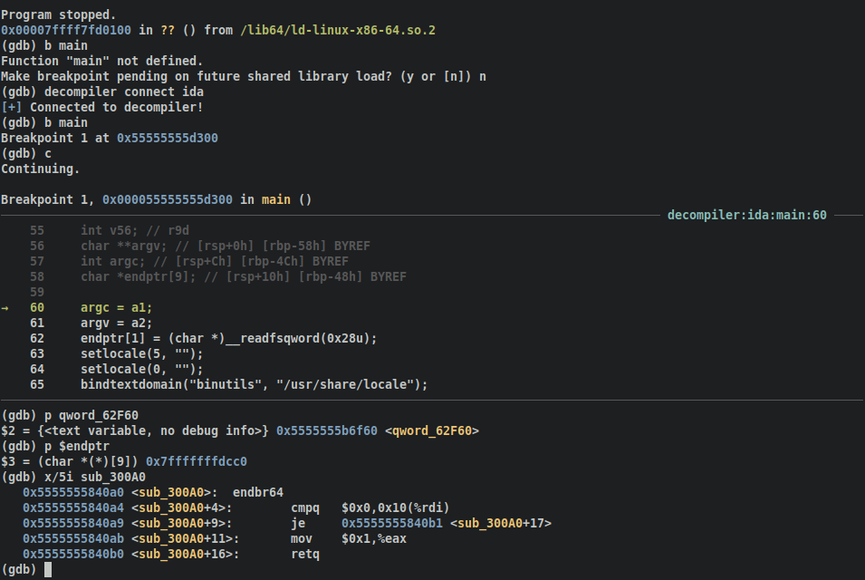

# decomp2dbg
A plugin to introduce a generic API for decompiler-to-debugger symbol syncing a decopilation
printing. In effect, a simple way to debug a black-box binary as if you had pseudo source symbols.
Currently supported in GDB with any additional plugin like [GEF](https://github.com/hugsy/gef) or 
[pwndbg](https://github.com/pwndbg/pwndbg).



[IDA Demo w/ GEF](https://asciinema.org/a/442740)

[Binja Demo w/ GEF](https://t.co/M2IZd0fmi3)

[](https://discord.gg/wZSCeXnEvR)

## Install (script/fast)
The easiest and fastest way to install is using the `install.sh` script!
```bash
./install.sh --ida /path/to/ida/plugins
```

Make sure to define the correct option for your decompiler of choice. Use `--help` for more info!
Note: You may need to allow inbound connections on port 3662, or the port you use, for decomp2dbg to connect
to the decompiler. 

> Note: after install its important that you check your `~/.gdbinit`

## Install (manual)
If you can't use the script (non-WSL Windows install for the decompiler), follow the steps below: 

If you only need the decompiler side of things, copy the associated decompiler plugin to the
decompiler's plugin folder. Here is how you do it in IDA:

Copy all the files in `./decompilers/d2g_ida/` into your ida `plugins` folder:
```bash
cp -r ./decompilers/d2d_ida/* /path/to/ida/plugins/
```

If you also need to install the gdb side of things, use the line below: 
```bash
pip3 install . && \
cp decomp2dbg.py ~/.decomp2dbg.py && echo "source ~/.decomp2gef.py" >> ~/.gdbinit
```

## Usage 
First, start the decompilation server on your decompiler. This can be done by using the hotkey `Ctrl-Shift-D`,
or selecting the `decomp2GEF: configure` tab in your associated plugins tab (under `Tools` in Binja). After starting the server, you should
see a message in your decompiler
```
[+] Starting XMLRPC server: localhost:3662
[+] Registered decompilation server!
```

Next, in your debugger, run:
```bash
decompiler connect <decompiler_name>
```

If you are running the decompiler on a VM or different machine, you can optionally provide the host and 
port to connect to. Here is an example:
```bash
decompiler connect ida 10.211.55.2 3662
```

First connection can take up to 30 seconds to register depending on the amount of globals in the binary.
If all is well, you should see:
```bash
[+] Connected to decompiler!
```

### Decompilation View
On each breakpoint event, you will now see decompilation printed, and the line you are on associated with
the break address. 

### Functions and Global Vars
Functions and Global Vars from your decompilation are now mapped into your GDB like normal Source-level 
symbols. This means normal GDB commands like printing and examination are native:
```bash
b sub_46340
x/10i sub_46340
```
```bash
p dword_267A2C 
x dword_267A2C
```

### Stack Variables and Function Args
Some variables that are stored locally in a function are stack variables. For the vars that can be mapped
to the stack, we import them as convenience variables. You can see their contents like a normal GDB convenience
variable:
```bash 
p $v4
```

Stack variables will always store their address on the stack. To see what value is actually in that stack variable,
simply dereference the variable:
```bash
x $v4
```

This also works with function arguments if applicable (mileage may vary):
```bash
p $a1
```

Note: `$v4` in this case will only be mapped for as long as you are in the same function. Once you leave the function
it may be unmapped or remapped to another value.

## Abstract
The reverse engineering process often involves both static (decompilers) and dynamic (debuggers) analysis to
achieve understanding of a binary target. Although this process is used often, the cost to context-switch between
dynamic and static analysis is high. Attempts to bridge this gap often fail to incorporate the live-updates of dynamic
analysis while preserving the structured types and names of static analysis. 

Decompilers and debuggers often [share many things in common](https://github.com/angr/binsync). During the reversing process, engineers produce reverse
engineering artifacts (REAs). These REAs are often diffs of the original data found in static analysis. The
most common REAs are:
- stack variables
- global variables
- structs
- enums
- function headers
- comments

Utilizing REAs, decomp2dbg aims to shorten the gap between using static and dynamic analysis to understand
a given binary target. 

## Features
- [X] Auto-updating decompilation context view
- [X] Auto-syncing function names
- [X] Breakable/Inspectable symbols
- [X] Auto-syncing stack variable names
- [ ] Auto-syncing structs

## Supported Platforms
### Debuggers
- **GDB**
  - Any plugin like **pwndbg** and **gef**.
### Decompilers
- IDA Pro
- Binary Ninja
- [angr-decompiler](https://github.com/angr/angr-management)
